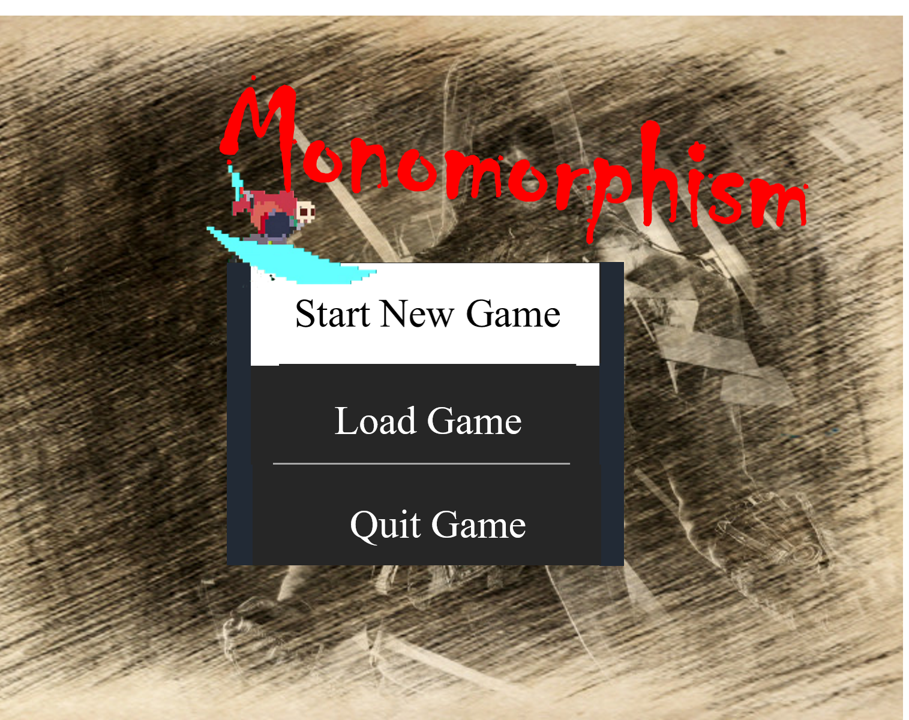

Monomorphism - A 2D Action Game
=========================
[](https://github.com/MonomorphismTeam/Monomorphism)
[](https://github.com/MonomorphismTeam/Monomorphism)


A 2D Action Game, Easy for greener, Fully for fun, Endless Playing

<p align="center">
  
  <br />
  <br />
</p>

Requirements
------------

* Win 10

Installation
------------
```
git clone git@github.com:release/Monomorphism.exe 
```
Or [The Most Detailed Installation Guide](https://github.com/MonomorphismTeam), any questions refer to [Monomorphism Team](https://github.com/MonomorphismTeam)

Quick Start
-------------

* Select 'Start New Game' for new game from Stage 1, Select 'Load Game' to start at the stage you died, Select 'Quit Game' to quit.
* You can Press 'P' at anytime to pause Game, and Select 'Back to Game' or 'Back to Menu' to get back to Game or Menu.
* Press 'Shift' to Shift, Press 'Space' to Jump, Press 'W' 'A ''D' to Move, Press the Left Mouse Button to Attack.
* While you are playing, you are not asked to kill all the monsters but to pass the door at end of the stage. Therefore, you can select a strategy suitable for you. At no time can you Pass all stages.
* More information can be found at [The Most Detailed Playing Guide](https://github.com/MonomorphismTeam)
* Playing Too Much is Bad for your Health.


